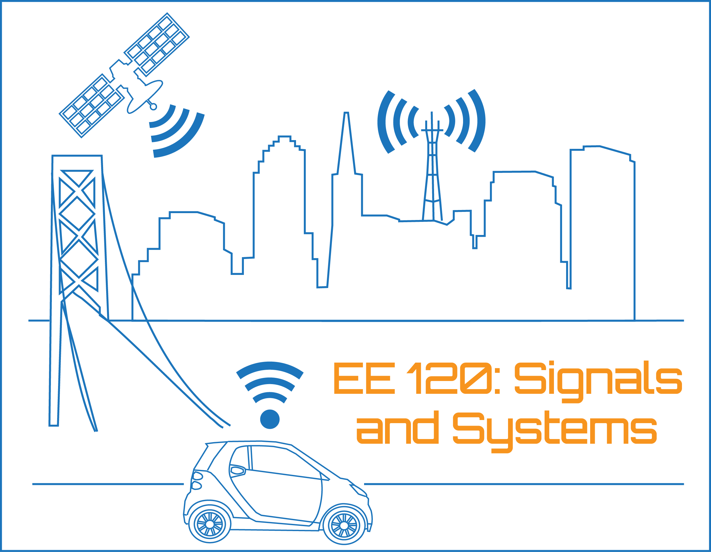

# EE120 Home Page

[University of California at Berkeley](http://www.berkeley.edu/)  
[Department of Electrical Engineering and Computer Sciences](http://www.eecs.berkeley.edu/)

## EE120: Signals and Systems

### Fall Semester 2019

Course information: [UCB On-Line Course Catalog and Schedule of Classes](http://schedule.berkeley.edu/)

---

### Lecture Information

Tuesdays and Thursdays, 12:00PM-2:00PM, **50 Birge Hall**

### Recitations

-   Friday 2:30PM-3:30PM (**521 Cory Hall**)
-   Friday 3:30PM-4:30PM (**521 Cory Hall**)
-   Friday 4:30PM-5:30PM (**521 Cory Hall**)

---

### Instructor

-   [Dr. Murat Arcak](http://www.eecs.berkeley.edu/~arcak), 569 Cory Hall
-   arcak at berkeley.edu
-   http://www.eecs.berkeley.edu/~arcak

---

### Graduate Student Instructors (GSIs) and Undergraduate Student Instructors (UGSIs)

-   Dominic Carrano
-   Ilya Chugunov
-   Alex Devonport
-   Jonathan Lee
-   Mindy Perkins

---

### Web Site

bCourses will be used for announcements, lecture notes, grades, and solutions to tests and homework sets. Piazza will be used for discussion and polls.

---

### References

Lecture notes are provided. The following textbook is recommended but not required:

-   "Signals and Systems," Oppenheim & Willsky, Prentice-Hall, 2nd ed., 1997.

---

### Grading

Homework: 15 points. Midterms 1 and 2: 25 points each. Final: 35 points.

---

### Homework Drop Policy

The lowest **one** homework **or** lab score is dropped.

---

### Course Outline

#### Linear Time Invariant Systems

-   [Lecture 1 (signals; system properties)](./LectureNotes/Lecture1.pdf)
-   [Lecture 2 (convolution)](./LectureNotes/Lecture2.pdf)
-   [Lecture 3 (response to exponentials)](./LectureNotes/Lecture3.pdf)

#### Frequency Domain Representation of Signals and Systems

-   [Lecture 4 (Fourier series in continuous time)](./LectureNotes/Lecture4.pdf)
-   [Lecture 5 (Fourier series in discrete time)](./LectureNotes/Lecture5.pdf)
-   [Lecture 6 (the continuous-time Fourier transform)](./LectureNotes/Lecture6.pdf)
-   [Lecture 7 (the continuous-time Fourier transform, continued)](./LectureNotes/Lecture7.pdf)
-   [Lecture 8 (the discrete-time Fourier transform)](./LectureNotes/Lecture8.pdf)
-   [Lecture 9 (the discrete-time Fourier transform, continued)](./LectureNotes/Lecture9.pdf)
-   [Lecture 10 (the DFT; FIR filters)](./LectureNotes/Lecture10.pdf)
-   [Lecture 11 (Fourier transforms in two dimensions)](./LectureNotes/Lecture11.pdf)

#### Sampling

-   [Lecture 12 (sampling)](./LectureNotes/Lecture12.pdf)
-   [Lecture 13 (the Shannon-Nyquist Sampling theorem)](./LectureNotes/Lecture13.pdf)
-   [Lecture 14 (discrete-time processing of continuous-time signals)](./LectureNotes/Lecture14.pdf)

#### Laplace Transform

-   [Lecture 15 (the Laplace transform)](./BonusWorksheets/Lecture15.pdf)
-   [Lecture 16 (transfer functions)](./BonusWorksheets/Lecture16.pdf)
-   [Lecture 17 (Bode plots)](./BonusWorksheets/Lecture17.pdf)
-   [Lecture 18 (step response of second-order systems; the unilateral Laplace transform)](./BonusWorksheets/Lecture18.pdf)
-   [Lecture 19 (feedback systems; root locus analysis)](./BonusWorksheets/Lecture19.pdf)
-   [Lecture 20 (tracking and disturbance rejection with feedback)](./BonusWorksheets/Lecture20.pdf)

#### Z Transform

-   [Lecture 21 (the z-transform)](./BonusWorksheets/Lecture21.pdf)
-   [Lecture 22 (transfer functions of discrete-time systems)](./BonusWorksheets/Lecture22.pdf)
-   [Lecture 23 (the unilateral Z-transform; block diagrams of discrete-time systems)](./BonusWorksheets/Lecture23.pdf)

---

### Assignments

-   [Homework 1](./Assignments/hw1_19f.pdf)
-   [Homework 2](./Assignments/hw2_19f.pdf)
-   [Homework 3](./Assignments/hw3_19f.pdf)
-   [Homework 4](./Assignments/hw4_19f.pdf)
-   [Homework 5](./Assignments/hw5_19f.pdf)
-   [Homework 6](./Assignments/hw6_19f.pdf)

---

### Labs

-   [Lab 1](./Labs/lab1.zip)
-   [Lab 2](./Labs/lab2.zip)
-   [Lab 3](./Labs/lab3.zip)
-   [Lab 4](./Labs/lab4.zip)
-   [Lab 5](./Labs/lab5.zip)
-   [Lab 6](./Labs/lab6.zip)

---

### Bonus Worksheets

-   [CTFT/DTFT](./BonusWorksheets/ctft-dtft-bonus.pdf) [(solution)](./BonusWorksheets/ctft-dtft-bonus-sol.pdf)
-   [Difference/Differential equations](./BonusWorksheets/difference-differential-bonus.pdf) [(solution)](./BonusWorksheets/difference-differential-bonus-sols.pdf)
-   [Root Locus Analysis](./BonusWorksheets/root-locus-bonus-v2.pdf) [(solution)](./BonusWorksheets/root-locus-bonus-sols-v2.pdf)
-   [Sampling](./BonusWorksheets/sampling-bonus.pdf) [(solution)](./BonusWorksheets/sampling-bonus-sol.pdf)

---

### Guest Lectures

-   Signals and Synthesizers: a brief tour of the Moog Werkstatt-01
    -   [Demo note](./Extra/demo-note-synthesizer.pdf)
    -   [Patch worksheet](./Extra/patch-worksheet.pdf)

---

### Policy on Academic Dishonesty

Copying all or part of another person's work, allowing another student to copy your work, or using material not specifically allowed (such as online solution manuals for homework problems), are forms of cheating and are not tolerated in this course. All forms of cheating will be referred to the Office of Student Conduct. Note that the policy for students involved in a second incident of cheating is dismissal from the University.
